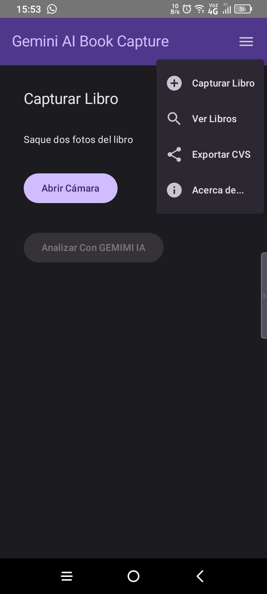
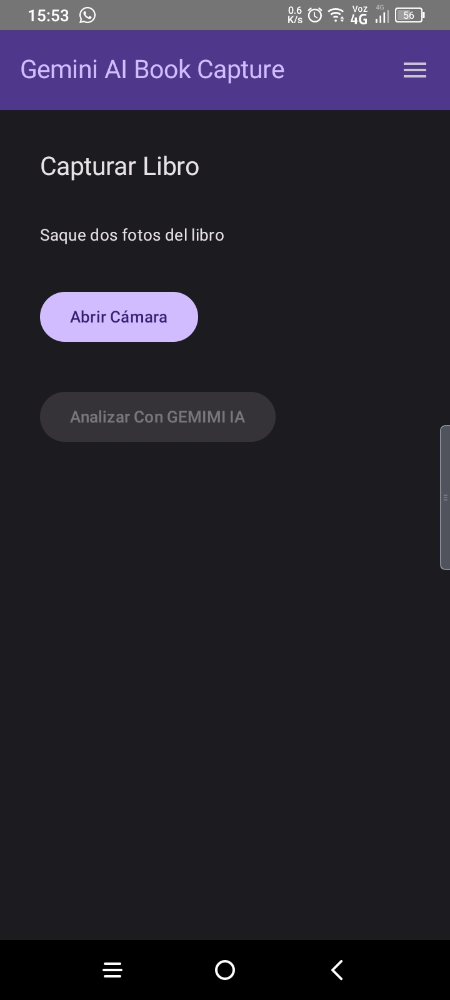
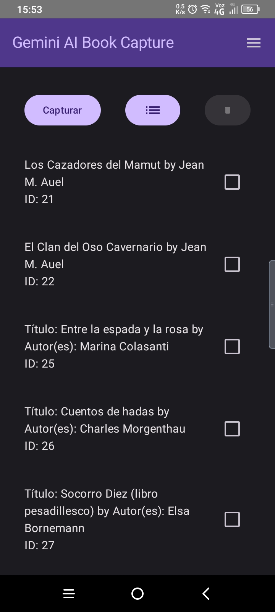

# Miiweb - Gemini AI Book Capture 📚✨

https://www.miiweb.com.ar/gemini-ai-book-capture/

**Digitaliza tu biblioteca personal sin esfuerzo con Miiweb "Gemini IA book Capture".** Saca una foto a la portada de un libro y deja que la inteligencia artificial de Gemini haga el resto. Extrae, edita y gestiona los datos de tus libros como nunca antes.

## ✨ Características Principales

*   📸 **Captura Inteligente:** Usa la cámara de tu móvil para capturar la portada de cualquier libro. Nuestra IA se encarga de analizar la imagen al instante.
*   🧠 **Extracción con IA Gemini:** La potente IA de Google Gemini extrae automáticamente el título, autor, editorial y otros datos relevantes directamente de la foto de la portada.
*   ✏️ **Edición Fácil y Rápida:** ¿La IA no acertó algún dato? No hay problema. Edita y corrige cualquier campo de forma intuitiva antes de guardar el libro en tu colección.
*   💾 **Guarda y Organiza:** Almacena todos tus libros digitalizados directamente en la aplicación.
*   📄 **Exporta tu Colección:** Exporta fácilmente tu biblioteca a un archivo CSV para usarla en hojas de cálculo, realizar copias de seguridad u otras aplicaciones.

## 📸 Capturas de Pantalla:

## 🛠️ Tecnologías Utilizadas

*   **Lenguaje:** Kotlin
*   **UI:** Jetpack Compose
*   **Inteligencia Artificial:** Google Gemini API - Google AI Studio Key)
*   **Procesamiento de Imágenes:** (Mencionar si usas alguna librería específica, ej: CameraX, ML Kit para la captura/preparación)
*   **Arquitectura:** MVVM (Model-View-ViewModel) con Android Jetpack ViewModel
*   **Base de Datos Local:** Room Persistence Library
*   **Navegación:** Jetpack Navigation Component (Compose)
*   **Asincronía:** Kotlin Coroutines & Flow
*   **Inyección de Dependencias:** (Hilt/Dagger, Koin - si aplica)
*   **Permisos:** (Mencionar librerías si usas alguna para simplificar, ej: `accompanist-permissions`)

## 🚀 Cómo Empezar

### Requisitos Previos

*   Android Studio Android Studio Narwhal Feature Drop o Vcode
*   JDK [18]
*   ADK Android [14] 
*   Una clave API de Google Gemini:
    *   Deberás obtener tu propia clave API desde [Google AI Studio](https://aistudio.google.com/app/apikey) (o el servicio correspondiente que estés usando para Gemini).

### Instalación

1.  **Clona el repositorio:**
2.  **Navega a la carpeta de la aplicación:**
3.  **Ejecuta Android Studio e importa el proyecto:**
4.  **Api Key de Google AI Studio: Modificar el archivo [com/example/miiweb/BuildConfig.java] con la api correspondiente **
6.  **Inicia la actividad principal:**
5.. **Listo!**

### Configuración Modelo IA Gemini 
1.  **Navega a la carpeta de la aplicación y ubica el archivo  [java/com/example/miiweb/BakingViewModel.kt], especificar el modelo a utilizar en modelName:
'''
private val generativeModel = GenerativeModel(
    modelName = "gemini-1.5-flash",
    apiKey = BuildConfig.apiKey
    )

